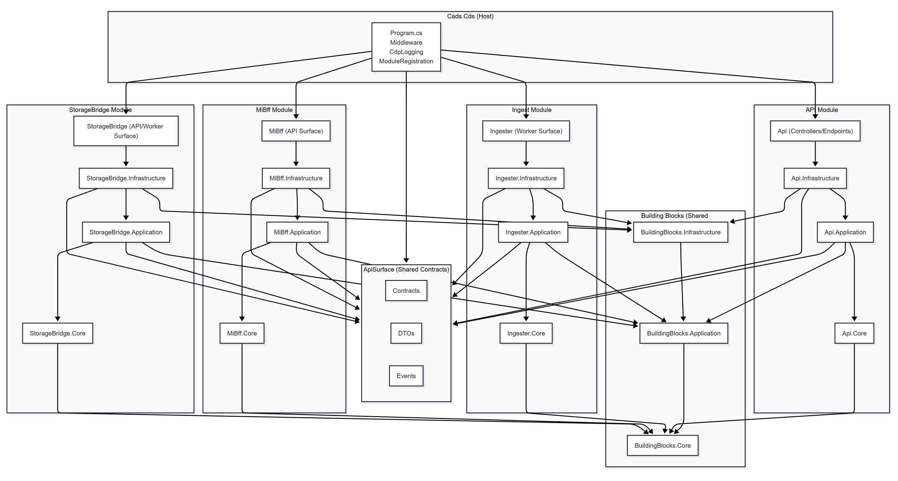

# CADS Central Data Service (CDS)

## Table of Contents

- [Overview](#overview)
- [Prerequisites](#prerequisites)
- [Project Structure](#project-structure)
- [Getting Started](#getting-started)
  - [Local Development Setup](#local-development-setup)
  - [Running the Application](#running-the-application)
- [Testing](#testing)
- [Development](#development)
  - [Building](#building)
  - [Code Quality](#code-quality)
  - [Contributing](#contributing)
- [Deployment](#deployment)
  - [CDP Environments](#cdp-environments)
- [Architecture](#architecture)
- [Licence](#licence)

## Overview

The CADS Central Data Service (CDS) will provide a central authoritative store of animal data across GB.

The CDS will provide a single data system and reporting service bringing together all GB livestock data to enable faster disease control, value-added services to industry, integration with national livestock systems, policy insight and compliance across DEFRA and partner bodies.

Objectives:

 - Integrate and standardise animal data across species and sources
 - Improve timeliness and accuracy of traceability data
 - Enable secure, governed data access for analytics and policy use
 - Support transition to nation-specific multi-species traceability regimes

**Technology Stack:**
- .NET 10
- ASP.NET Core
- PostgreSQL
- Redis
- AWS S3
- AWS SQS
- AWS (LocalStack for local development)
- Docker & Docker Compose

## Prerequisites

- **.NET 10 SDK** - [Download](https://dotnet.microsoft.com/download/dotnet/10.0)
- **Docker & Docker Compose** - [Download](https://www.docker.com/products/docker-desktop)
- **Git** - [Download](https://git-scm.com/)

## Project Structure

```
/Cads.Cds.sln
/src
  /Cads.Cds                          <-- HOST (Composition Root)
    Program.cs
    appsettings.json
    /Configuration
    /Middleware
      ExceptionHandlingMiddleware.cs
    /Setup
      ModuleRegistration.cs
      ServiceCollectionExtensions.cs
      HostBuilderExtensions.cs

  /ApiSurface                        <-- Shared API contracts
    /Contracts
    /DTOs
    /Events

  /BuildingBlocks                    <-- Shared cross-cutting foundation
    /Cads.Cds.BuildingBlocks.Core
    /Cads.Cds.BuildingBlocks.Application
    /Cads.Cds.BuildingBlocks.Infrastructure
    /Cads.Cds.BuildingBlocks.Testing.Support

  /Modules                           <-- Vertical feature modules
    /Cads.Cds.Api
      /Cads.Cds.Api.Core
      /Cads.Cds.Api.Application
      /Cads.Cds.Api.Infrastructure
      /Cads.Cds.Api (Host-facing API surface)

    /Cads.Cds.Ingester
      /Cads.Cds.Ingester.Core
      /Cads.Cds.Ingester.Application
      /Cads.Cds.Ingester.Infrastructure
      /Cads.Cds.Ingester (Host-facing worker surface)

    /Cads.Cds.MiBff
      /Cads.Cds.MiBff.Core
      /Cads.Cds.MiBff.Application
      /Cads.Cds.MiBff.Infrastructure
      /Cads.Cds.MiBff (Host-facing API surface)

    /Cads.Cds.StorageBridge
      /Cads.Cds.StorageBridge.Core
      /Cads.Cds.StorageBridge.Application
      /Cads.Cds.StorageBridge.Infrastructure
      /Cads.Cds.StorageBridge (Host-facing worker surface)

  /Database
    /Liquibase
    /Scripts
    /SeedData

/tests
  Cads.Cds.Tests.Unit
  
  /BuildingBlocks
    Cads.Cds.BuildingBlocks.Core.Tests.Unit
    Cads.Cds.BuildingBlocks.Application.Tests.Unit
    Cads.Cds.BuildingBlocks.Infrastructure.Tests.Unit

  /Modules
    /Api
      Cads.Cds.Api.Tests.Component
      Cads.Cds.Api.Tests.Integration
      Cads.Cds.Api.Core.Tests.Unit
      Cads.Cds.Api.Application.Tests.Unit
      Cads.Cds.Api.Infrastructure.Tests.Unit

    /Ingester
      Cads.Cds.Ingester.Tests.Component
      Cads.Cds.Ingester.Tests.Integration
      Cads.Cds.Ingester.Core.Tests.Unit
      Cads.Cds.Ingester.Application.Tests.Unit
      Cads.Cds.Ingester.Infrastructure.Tests.Unit

    /MiBff
      Cads.Cds.MiBff.Tests.Component
      Cads.Cds.MiBff.Tests.Integration
      Cads.Cds.MiBff.Core.Tests.Unit
      Cads.Cds.MiBff.Application.Tests.Unit
      Cads.Cds.MiBff.Infrastructure.Tests.Unit

    /StorageBridge
      Cads.Cds.StorageBridge.Tests.Component
      Cads.Cds.StorageBridge.Tests.Integration
      Cads.Cds.StorageBridge.Core.Tests.Unit
      Cads.Cds.StorageBridge.Application.Tests.Unit
      Cads.Cds.StorageBridge.Infrastructure.Tests.Unit
```

### Project Dependency Flow



### Project Details

#### Cads.Cds (Host)

The composition root of the Modulat Monalithic Service.

This is responsible for:

 - how the application starts
 - middleware
 - configuration
 - logging
 - dependency injection & wiring up the modules

#### ApiSurface (Shared Contracts)

A **shared contract layer** used across all modules.

Contains:
- DTOs
- API request/response models
- Event contracts
- Shared enums and value objects

This ensures all modules do not need to reference each other.

#### BuildingBlocks (Shared Foundation)

These are stable, reusable building blocks that modules depend on.

- Core: domain primitives, exceptions, abstractions
- Application: behaviours, pipelines, interfaces
- Infrastructure: shared infrastructure (JSON, AWS helpers etc)
- Testing.Support: reusable test fixtures, mocks, helpers

#### Modules

Each module is a vertical slice with clean internal layering@

```
Module.Surface → Module.Infrastructure → Module.Application → Module.Core
```

Each module is fully isolated and independently testable.

#### Database

Contains:
- Liquibase changelogs
- SQL scripts
- Seed data

This is the authoritative source of schema evolution.

#### Tests

Tests are structured to mirror the production code:

- Unit tests for each layer
- Component tests for module surfaces
- Integration tests for module infrastructure
- Shared test utilities in Testing.Support

This structure ensures clarity, isolation, and high coverage.

## Getting Started

### Local Development Setup

1. **Clone the repository:**
   ```bash
   git clone https://github.com/DEFRA/cads-data-service.git
   cd cads-data-service
   ```

2. **Restore NuGet packages:**
   ```bash
   dotnet restore
   ```
### Running the Application

1. **Start the local development environment:**
   ```bash
   docker-compose -f docker-compose.yml -f docker-compose.override.yml up --build
   ```

   For MacOS use
   `docker-compose.override.mac.intel.yml` or `docker-compose.override.mac.arm.yml`

   This starts:
   - Redis
   - LocalStack (S3, SQS)
   - This service
     - root: `http://localhost:5555`

2. **Verify services are running:**
   ```bash
   docker compose ps
   ```
   Or open Docker Desktop dashboard and inspect the containers tab.
3. **Access pgAdmin4:**
   - Open a web browser and navigate to `http://localhost:16543`.
   - Use the default credentials: `pgadmin@pgadmin.com` and `password`.
   - Configure a new server connection to connect to the PostgreSQL database running in the container.
     - Server: postgres
     - Username: postgres
     - Password: password

A more extensive setup is available in [github.com/DEFRA/cdp-local-environment](https://github.com/DEFRA/cdp-local-environment)

### Testing

A guide for the testing standards can be [found here](https://eaflood.atlassian.net/wiki/spaces/LDD/pages/6435308220/Backend+development+testing+baseline).

To execute all tests you can use the following command:

```
dotnet test Cads.Cds.sln
```

To execute all tests except integration tests:

```
dotnet test Cads.Cds.sln --filter Dependence!=testcontainers
```

To execute all integration tests:

```
dotnet test Cads.Cds.sln --filter Dependence=testcontainers
```

#### Test Code Coverage Reports

To generate test coverage reports locally during development, you can use the below:

Step 1: Install the report generator globally

```
dotnet tool install --global dotnet-reportgenerator-globaltool
```

Step 2: Run all tests except integration tests

```
dotnet test Cads.Cds.sln --collect:"XPlat Code Coverage" --filter Dependence!=testcontainers
```

Step 3: Create the report but exclude the `Cads.Cds.BuildingBlocks.Testing.Support` project

```
reportgenerator -reports:"**/TestResults/**/coverage.cobertura.xml" -targetdir:"coverage-report" -reporttypes:"Cobertura;Html;MarkdownSummary" -filefilters:"-*.g.cs" -assemblyfilters:"-*.Tests.*;-Cads.Cds.BuildingBlocks.Testing.Support"
```

Before running steps 2 & 3, it is a good idea to delete any existing coverage report files to avoid interference from previous results.

```
Get-ChildItem -Directory -Recurse -Filter "TestResults" | Remove-Item -Recurse -Force
Get-ChildItem -Directory -Recurse -Filter "coverage-report" | Remove-Item -Recurse -Force
```

### About the licence

The Open Government Licence (OGL) was developed by the Controller of Her Majesty's Stationery Office (HMSO) to enable
information providers in the public sector to license the use and re-use of their information under a common open
licence.

It is designed to encourage use and re-use of information freely and flexibly, with only a few conditions.