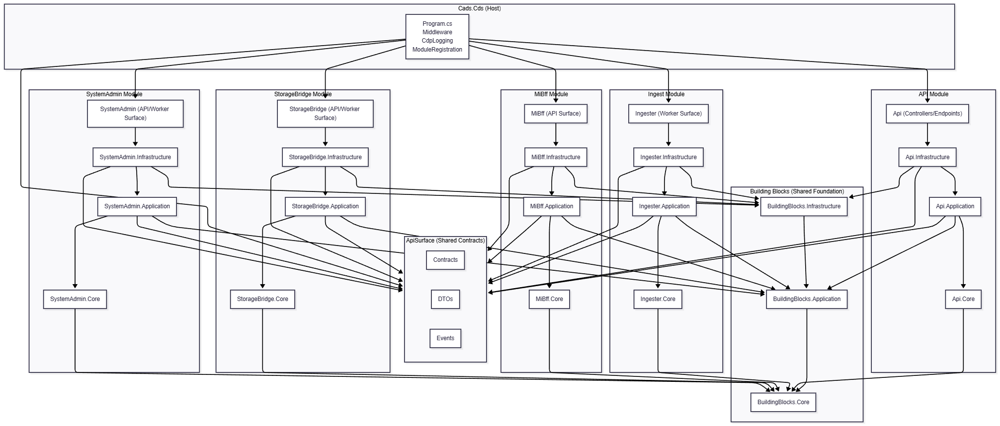

# CADS Central Data Service (CDS)

## Table of Contents

- [Overview](#overview)
- [Prerequisites](#prerequisites)
- [Project Structure](#project-structure)
- [Getting Started](#getting-started)
  - [Local Development Setup](#local-development-setup)
  - [Running the Application](#running-the-application)
- [Testing](#testing)
- [Development](#development) 
  - [Database](#database)
  - [Building](#building)
  - [Code Quality](#code-quality)
  - [Contributing](#contributing)
- [Deployment](#deployment)
  - [CDP Environments](#cdp-environments)
- [Architecture](#architecture)
- [Licence](#licence)

## Overview

The CADS Central Data Service (CDS) will provide a central authoritative store of animal data across GB.

The CDS will provide a single data system and reporting service bringing together all GB livestock data to enable faster disease control, value-added services to industry, integration with national livestock systems, policy insight and compliance across DEFRA and partner bodies.

Objectives:

 - Integrate and standardise animal data across species and sources
 - Improve timeliness and accuracy of traceability data
 - Enable secure, governed data access for analytics and policy use
 - Support transition to nation-specific multi-species traceability regimes

**Technology Stack:**
- .NET 10
- ASP.NET Core
- PostgreSQL
- Redis
- AWS S3
- AWS SQS
- AWS (LocalStack for local development)
- Docker & Docker Compose

## Prerequisites

- **.NET 10 SDK** - [Download](https://dotnet.microsoft.com/download/dotnet/10.0)
- **Docker & Docker Compose** - [Download](https://www.docker.com/products/docker-desktop)
- **Git** - [Download](https://git-scm.com/)
- **CADS Tools** - [CADS Tools](https://github.com/DEFRA/cads-tools)

## Project Structure

```
/Cads.Cds.sln
/src
  /Cads.Cds                          <-- HOST (Composition Root)
    Program.cs
    appsettings.json
    /Configuration
    /Middleware
      ExceptionHandlingMiddleware.cs
    /Setup
      ModuleRegistration.cs
      ServiceCollectionExtensions.cs
      HostBuilderExtensions.cs

  /ApiSurface                        <-- Shared API contracts
    /Contracts
    /DTOs
    /Events

  /BuildingBlocks                    <-- Shared cross-cutting foundation
    /Cads.Cds.BuildingBlocks.Core
    /Cads.Cds.BuildingBlocks.Application
    /Cads.Cds.BuildingBlocks.Infrastructure
    /Cads.Cds.BuildingBlocks.Testing.Support

  /Modules                           <-- Vertical feature modules
    /Cads.Cds.Api
      /Cads.Cds.Api.Core
      /Cads.Cds.Api.Application
      /Cads.Cds.Api.Infrastructure
      /Cads.Cds.Api (Host-facing API surface)

    /Cads.Cds.Ingester
      /Cads.Cds.Ingester.Core
      /Cads.Cds.Ingester.Application
      /Cads.Cds.Ingester.Infrastructure
      /Cads.Cds.Ingester (Host-facing worker surface)

    /Cads.Cds.MiBff
      /Cads.Cds.MiBff.Core
      /Cads.Cds.MiBff.Application
      /Cads.Cds.MiBff.Infrastructure
      /Cads.Cds.MiBff (Host-facing API surface)

    /Cads.Cds.StorageBridge
      /Cads.Cds.StorageBridge.Core
      /Cads.Cds.StorageBridge.Application
      /Cads.Cds.StorageBridge.Infrastructure
      /Cads.Cds.StorageBridge (Host-facing worker surface)

  /Database
    /Liquibase
    /Scripts
    /SeedData

/tests
  Cads.Cds.Tests.Unit
  
  /BuildingBlocks
    Cads.Cds.BuildingBlocks.Core.Tests.Unit
    Cads.Cds.BuildingBlocks.Application.Tests.Unit
    Cads.Cds.BuildingBlocks.Infrastructure.Tests.Unit

  /Modules
    /Api
      Cads.Cds.Api.Tests.Component
      Cads.Cds.Api.Tests.Integration
      Cads.Cds.Api.Core.Tests.Unit
      Cads.Cds.Api.Application.Tests.Unit
      Cads.Cds.Api.Infrastructure.Tests.Unit

    /Ingester
      Cads.Cds.Ingester.Tests.Component
      Cads.Cds.Ingester.Tests.Integration
      Cads.Cds.Ingester.Core.Tests.Unit
      Cads.Cds.Ingester.Application.Tests.Unit
      Cads.Cds.Ingester.Infrastructure.Tests.Unit

    /MiBff
      Cads.Cds.MiBff.Tests.Component
      Cads.Cds.MiBff.Tests.Integration
      Cads.Cds.MiBff.Core.Tests.Unit
      Cads.Cds.MiBff.Application.Tests.Unit
      Cads.Cds.MiBff.Infrastructure.Tests.Unit

    /StorageBridge
      Cads.Cds.StorageBridge.Tests.Component
      Cads.Cds.StorageBridge.Tests.Integration
      Cads.Cds.StorageBridge.Core.Tests.Unit
      Cads.Cds.StorageBridge.Application.Tests.Unit
      Cads.Cds.StorageBridge.Infrastructure.Tests.Unit
```

### Project Dependency Flow



### Project Details

#### Cads.Cds (Host)

The composition root of the Modulat Monalithic Service.

This is responsible for:

 - how the application starts
 - middleware
 - configuration
 - logging
 - dependency injection & wiring up the modules

#### ApiSurface (Shared Contracts)

A **shared contract layer** used across all modules.

Contains:
- DTOs
- API request/response models
- Event contracts
- Shared enums and value objects

This ensures all modules do not need to reference each other.

#### BuildingBlocks (Shared Foundation)

These are stable, reusable building blocks that modules depend on.

- Core: domain primitives, exceptions, abstractions
- Application: behaviours, pipelines, interfaces
- Infrastructure: shared infrastructure (JSON, AWS helpers etc)
- Testing.Support: reusable test fixtures, mocks, helpers

#### Modules

Each module is a vertical slice with clean internal layering@

```
Module.Surface → Module.Infrastructure → Module.Application → Module.Core
```

Each module is fully isolated and independently testable.

#### Database

Contains:
- Liquibase changelogs
- SQL scripts
- Seed data

This is the authoritative source of schema evolution.

#### Tests

Tests are structured to mirror the production code:

- Unit tests for each layer
- Component tests for module surfaces
- Integration tests for module infrastructure
- Shared test utilities in Testing.Support

This structure ensures clarity, isolation, and high coverage.

## Authentication

### API Key
Used for internal service‑to‑service calls.

### Cognito
Used for external user authentication (e.g., mobile/web).

### Azure AD
Used for internal staff / enterprise users.

### Policies
Different scheme support applies for different groups of endpoints.

## Getting Started

### Repository Layout

Your local workspace should contain all three repos side‑by‑side:

```
D:\git\cads-data-service      # Backend (this repo)
D:\git\cads-mis               # UI
D:\git\cads-tools             # Shared infra, OIDC mock, harness scripts
```

Clone them like this:

```
git clone https://github.com/DEFRA/cads-data-service.git
git clone https://github.com/DEFRA/cads-mis.git
git clone https://github.com/DEFRA/cads-tools.git
```

### Backend setup

**Restore NuGet packages:**

```bash
dotnet restore
```

**Create a .env file in the backend root:**

These values are used by the backend’s Docker Compose:
   
```bash
ENV=local
POSTGRES_USER=postgres
POSTGRES_PASSWORD=*****
POSTGRES_DB=cads_data_service
POSTGRES_REF_DB=reference_schema
PGADMIN_EMAIL=pgadmin@pgadmin.com
PGADMIN_PASSWORD=*****
```

Passwords can be anything for local development.

### Running the Application

The backend now uses a unified orchestration script:

```
platform/platform.sh
```

This script starts:

- Shared infra (Postgres, Redis, LocalStack, OIDC mock)
- Backend (CADS CDS + pgAdmin + Reference postgres database)
- UI (CADS MIS)
- Or any combination you want

It delegates infra to `cads-tools/harness/run-harness.sh`.

#### platform.sh — Commands

**Start shared infra only**

```
./platform/platform.sh tools
```

Starts:
- Postgres
- Redis
- LocalStack (S3, SQS)
- OIDC mock

**Start backend + shared infra**

```
./platform/platform.sh backend
```

Starts:
- CADS CDS
- pgAdmin
- Liquibase migration
- Reference postgres database

**Start UI + shared infra**

```
./platform/platform.sh ui
```

**Start everything (UI + backend + infra)**

```
./platform/platform.sh all
```

**Stop everything**

```
./platform/platform.sh down
```

This stops:
- UI
- Backend
- Shared infra

#### Mac Users — Architecture Override

Mac developers must specify their architecture when starting the backend or full platform.

**Mac Intel**

```
./platform/platform.sh backend --mac-intel
```

**Mac ARM (M1/M2/M3)**

```
./platform/platform.sh backend --mac-arm
```

**Full platform (UI + backend + infra)**

```
./platform/platform.sh all --mac-arm
```

Windows/Linux users do not need an override.

## Accessing Services

**Backend API**
http://localhost:5555

**UI**
http://localhost:3000

**pgAdmin**
http://localhost:16543

Login for pgAdmin:
- Email: pgadmin@pgadmin.com
- Password: (value from .env)

## Verifying Everything Is Running

```
docker compose ps
```

Or use Docker Desktop.

### Testing

A guide for the testing standards can be [found here](https://eaflood.atlassian.net/wiki/spaces/LDD/pages/6435308220/Backend+development+testing+baseline).

Because the integration tests projects must be run in sequence they must be run using a special command - an unfiltere `dotnet test` of the whole solution will fail the integration tests. 

To execute all tests except integration tests:

```
dotnet test Cads.Cds.sln --filter Dependence!=testcontainers
```

To execute all integration tests:

```
dotnet test cads.integrationtests.proj --filter Dependence=testcontainers -p:BuildInParallel=false
```

Note: All test classes in *Tests.Integration.csproj projects must be decorated with Dependence=testcontainers, or this readme and check-pull-request.yml workflow must be updated

#### Test Code Coverage Reports

To generate test coverage reports locally during development, you can use the below:

Step 1: Install the report generator globally

```
dotnet tool install --global dotnet-reportgenerator-globaltool
```

Step 2: Run all tests except integration tests

```
dotnet test Cads.Cds.sln --collect:"XPlat Code Coverage" --filter Dependence!=testcontainers
```

Step 3: Create the report but exclude the `Cads.Cds.BuildingBlocks.Testing.Support` project

```
reportgenerator -reports:"**/TestResults/**/coverage.cobertura.xml" -targetdir:"coverage-report" -reporttypes:"Cobertura;Html;MarkdownSummary" -filefilters:"-*.g.cs" -assemblyfilters:"-*.Tests.*;-Cads.Cds.*.Testing.Support"
```

Before running steps 2 & 3, it is a good idea to delete any existing coverage report files to avoid interference from previous results.

```
Get-ChildItem -Directory -Recurse -Filter "TestResults" | Remove-Item -Recurse -Force
Get-ChildItem -Directory -Recurse -Filter "coverage-report" | Remove-Item -Recurse -Force
```

## Development

### Database
The database schema is managed using [Liquibase](https://www.liquibase.org/).
The database schema is defined in the `changelog` directory with the various migrations defined in the `db.changelog.xml` file.
When docker-compose is run, any outstanding migrations will be applied to the database automatically and the liquibase container will continue to run.
A migration can be automatically generated using the following command:

```
docker exec -it cads_cds-liquibase-1 liquibase \
  --url=jdbc:postgresql://postgres:5432/<POSTGRES_DB> \
  --username=<POSTGRES_USER> \
  --password=<POSTGRES_PASSWORD> \
  --changelog-file=changelog/<new-migration-name>.sql \
  generate-changelog
```

Ensure to replace the postgres username, password and database name with the values from the `.env` file and specify the new migration name.
The newly generated migration will be placed in the `changelog` directory. Ensure that this is reviewd before adding an entry for this in the `db.changelog.xml` file and committing the change.

### Liquibase Workflow Guide

See detailed `Liquibase Workflow Guide` [here](./changelog/ReadMe.md)

### About the licence

The Open Government Licence (OGL) was developed by the Controller of Her Majesty's Stationery Office (HMSO) to enable
information providers in the public sector to license the use and re-use of their information under a common open
licence.

It is designed to encourage use and re-use of information freely and flexibly, with only a few conditions.
 