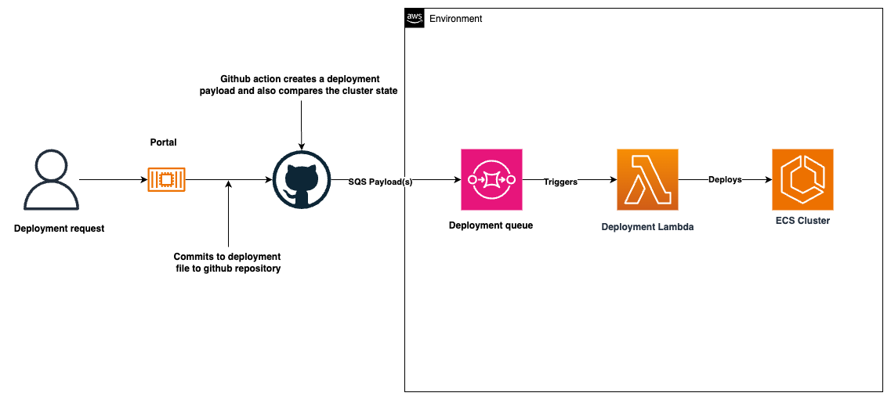
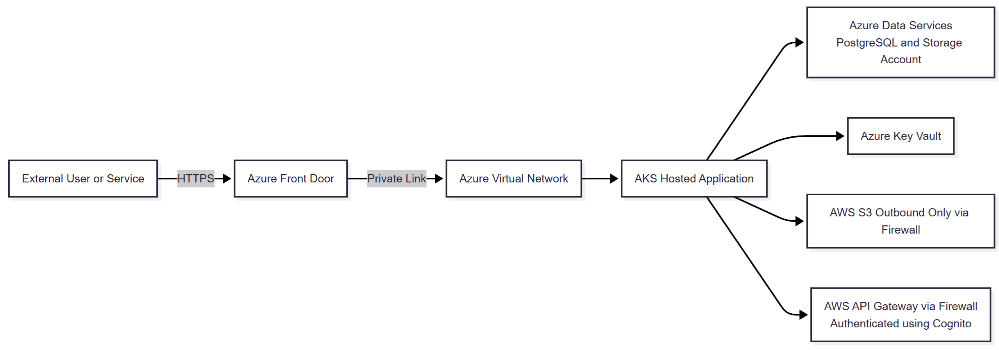
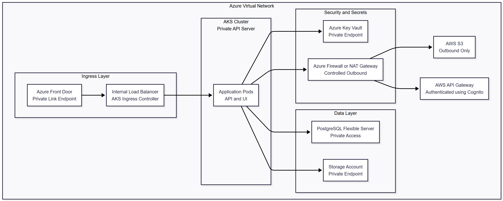

# Central Animal Data Store (CADS) - ADO, PostgreSQL and AKS Migration

## Current infrastructure and deployments

The CADS application is currently hosted within the **Core Delivery Platform (CDP)**.

### High-level Architecture

CDP is a multi‑tenant AWS‑based hosting platform designed to run microservices inside Docker containers. It provides a standardised hosting model but comes with strict constraints on how services are deployed and how data is accessed.

 * **Two network zones**

     * **Public zone** – hosts public‑facing UIs
     * **Protected zone** – hosts backend APIs, only reachable inside CDP

 * **ECS Fargate clusters**

    * One shared Fargate cluster per zone per environment
    * All tenant services run on the same cluster
    * No per‑service compute isolation
    * No support for multi‑image / multi‑container microservices

 * **Shared PostgreSQL (Aurora Serverless v2)**

     * One Aurora cluster per environment
     * All tenant databases share the same cluster
     * Default scaling: **0.5–4 ACUs** (4 ACU max is restrictive)
     * No tenant‑level control over scaling, failover, or performance isolation

 * **Strict single‑service ownership**

    * Each microservice may have **one dedicated database**
    * No other service can connect to that database
    * Cross‑service data access must be done via:

        * APIs
        * messaging
        * event streams

    * This enforces strong isolation but limits:

        * multi‑service ETL
        * cross‑service reporting
        * analytics workloads

### Deployment process

CDP uses an automated, GitHub‑driven deployment pipeline.

A deployment Lambda processes each instruction, builds a new ECS task definition, updates or creates the ECS service, registers the service in CloudMap for DNS, and sends status notifications. The updated service is then rolled out automatically to the appropriate ECS Fargate cluster.

### CDP limitations

 * **Shared ECS clusters**

     * No per‑service isolation
     * No ability to tune cluster‑level settings
     * No multi‑container deployments
     * No support for multi‑image pods (unlike Kubernetes/AKS)

 * **Shared Aurora cluster per environment**

     * No performance isolation
     * No independent scaling
     * No control over ACUs or instance classes
     * Restricted PostgreSQL privileges
     * No AWS extensions (e.g. S3 import, advanced ETL tooling)

 * **Limited Role Based Access Control (RBAC)**

     * One service -> one database -> one owning role
     * No cross‑service database access
     * No fine‑grained role hierarchies

 * **No infrastructure‑as‑code control**
     * Tenants cannot customise networking, compute, storage, or routing
     * All infrastructure is platform‑owned and centrally managed

### How this fits into the Azure migration PoC

These points highlight why CADS is constrained on CDP and why Azure provides a more flexible foundation:

 * CDP is **opinionated and restrictive**

 * CDP enforces **single‑container microservices**

 * CDP enforces **strict database isolation**

 * CDP limits **RBAC, networking, scaling, and database privileges**

 * CDP lacks flexibility for **modern microservice patterns**

 * CDP's shared infrastructure introduces **performance and scaling constraints**

 * Azure (AKS + PostgreSQL Flexible Server) removes nearly all of these limitations

## Proposed Azure PoC

The intention is to run a **small, internal PoC** in Azure to explore the platform's native tooling - specifically **Azure Kubernetes Service (AKS)** and **Azure Database for PostgreSQL Flexible Server**.

The PoC will follow the **CRDB‑Lite** process and will be delivered in a controlled, isolated environment with minimal footprint and minimal address space.

### Purpose of the PoC

The PoC is focused on validating Azure's core capabilities:

 * Running containerised workloads in **AKS**

 * Exploring **PostgreSQL Flexible Server** features such as partitioning and scaling

 * Validating basic outbound connectivity from Azure to:

     * AWS S3 (simple authenticated request only)
     * CDP‑hosted Microservices (APIs)

 * Testing Azure‑native components such as:

     * Azure Key Vault
     * Storage Accounts
     * Azure Firewall / NAT Gateway
     * Azure Front Door Private Link

This is purely exploratory and intended for **internal IT audiences**.

### Scope

 * A small AKS cluster

 * A single PostgreSQL Flexible Server instance

 * Basic application deployment into a private AKS namespace

 * Simple outbound test calls to AWS S3 and CDP APIs

 * No ingestion pipelines, no production data, no operational handover

 * No high availability or DR requirements beyond defaults

### Address space requirements

To support the PoC, we request a **small address space** suitable for a single AKS cluster and supporting services.

### Target Architecture

The PoC will use a simplified version of the future CADS architecture, focusing only on validating Azure components and basic connectivity.

**Ingress layer**

 * **Azure Front Door (Private Link)** – optional for PoC, used only to validate private ingress

 * **Internal Load Balancer + AKS Ingress Controller**

**AKS cluster**

 * Private API server

 * Application pods (simple API + UI)

 * Standard CCoE deployment patterns

**Data layer**

 * **PostgreSQL Flexible Server** (private access)

 * **Storage Account** (private endpoint)

**Security layer**

 * **Azure Key Vault** (private endpoint)

 * **Azure Firewall or NAT Gateway** for controlled outbound traffic

**Outbound connectivity (validation only)**

 * **AWS S3** – simple authenticated request

 * **CDP APIs** – simple authenticated API call

These tests are limited to confirming that Azure -> AWS/CDP connectivity works as expected.

### PostgreSQL PoC structure

**Phase 1 — Like‑for‑like baseline**

Use PostgreSQL Flexible Server to validate:

 * General Purpose or Memory Optimised tier

 * Realistic vCore/memory sizing

 * Zone‑redundant HA

 * 1–3 read replicas

 * Partitioning of the largest tables

 * Appropriate indexing

**Goal:** Confirm that Azure PostgreSQL can match or approach current Aurora behaviour with minimal change.

**Phase 2 — Scale‑out exploration (optional)**

If Phase 1 shows that a single primary may be a bottleneck, explore **Elastic Clusters (Citus)**:

 * Shard 1–2 large tables

 * Compare latency, concurrency, maintenance, and operational complexity

**Goal:** Determine whether CADS can remain on a single Flexible Server or would benefit from distributed PostgreSQL.

### C4 Context diagram

### C4 Container diagram

### Why this PoC is low‑risk

 * No production data

 * No ingestion pipelines

 * No downstream integrations

 * No operational dependency on Azure

 * Minimal cost and footprint

 * Fully reversible

 * Audience is **internal IT only**